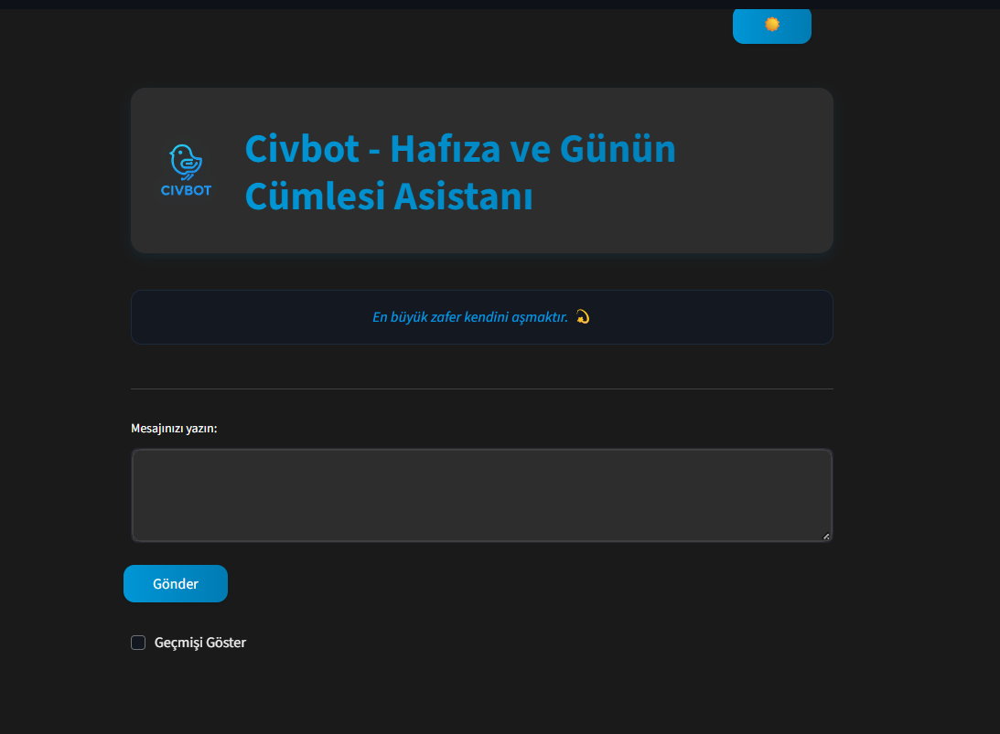

# 🤖 Civbot - Yapay Zeka Sohbet Asistanı

<div align="center">

[](https://www.python.org/downloads/)
[](https://streamlit.io)
[](https://ai.google.dev/)
[](https://opensource.org/licenses/MIT)

</div>

Civbot, yapay zeka destekli modern bir sohbet asistanıdır. Google'ın güçlü Gemini Pro modeli ve Streamlit'in kullanıcı dostu arayüzü ile geliştirilmiştir. Türkçe ve İngilizce dil desteği, akıllı yanıtlar ve sohbet geçmişi özellikleriyle kişisel asistanınız olmaya hazır.

<div align="center">
  
</div>

## ✨ Öne Çıkan Özellikler

| Özellik | Açıklama |
|---------|-----------|
| 🌍 **Çift Dil Desteği** | Tam Türkçe ve İngilizce desteği |
| 🧠 **Yapay Zeka Sohbet** | Gemini Pro AI ile akıllı konuşmalar |
| 💾 **Sohbet Geçmişi** | Konuşmaları kaydetme ve görüntüleme |
| 🌓 **Tema Desteği** | Koyu/Açık mod seçeneği |
| 💫 **Günün Sözü** | Günlük ilham verici alıntılar |
| 📱 **Duyarlı Tasarım** | Her cihaza uyumlu modern arayüz |

## 🎯 Kullanım Alanları

- 👤 **Kişisel Asistan**: Günlük görevler ve organizasyon
- 📚 **Dil Öğrenme**: İngilizce ve Türkçe pratik yapma
- 🔍 **Bilgi Edinme**: Hızlı ve doğru bilgi alma
- 📝 **Not Tutma**: Konuşmaları kaydetme ve düzenleme
- 📖 **Eğitim**: Öğrenme ve araştırma desteği

## 🛠️ Teknoloji Altyapısı

<div align="center">

| Kategori | Teknoloji | Sürüm |
|----------|-----------|--------|
| 🎨 **Frontend** | Streamlit | ≥1.31.0 |
| 🧠 **AI Model** | Gemini Pro | Latest |
| 💾 **Depolama** | JSON | - |
| ⚙️ **Backend** | Python | ≥3.11 |

</div>

## 📦 Kurulum Rehberi

### Ön Gereksinimler

- Python 3.11 veya üstü
- Git
- Google AI API anahtarı

### 1️⃣ Projeyi İndirin

```bash
git clone https://github.com/fatmaertasci/civbot.git
cd civbot
```

### 2️⃣ Python Ortamını Hazırlayın

```bash
# Sanal ortam oluşturma
python -m venv venv

# Sanal ortamı aktifleştirme
# Windows için:
.\venv\Scripts\activate
# Linux/Mac için:
source venv/bin/activate
```

### 3️⃣ Bağımlılıkları Yükleyin

```bash
pip install -r requirements.txt
```

### 4️⃣ API Anahtarını Ayarlayın

1. [Google AI Studio](https://makersuite.google.com/app/apikey) üzerinden API anahtarı alın
2. Proje klasöründe `.env` dosyası oluşturun:
   ```env
   GOOGLE_API_KEY=size_özel_api_anahtarınız
   ```

### 5️⃣ Uygulamayı Başlatın

```bash
streamlit run app.py
```

Uygulama otomatik olarak `http://localhost:8501` adresinde başlayacaktır.

## Kullanım Kılavuzu

1. Uygulama tarayıcınızda otomatik olarak açılacaktır
2. İlk kullanımda Google Gemini API anahtarınızı girmeniz istenecektir
3. Metin kutusuna mesajınızı yazın ve "Gönder" butonuna tıklayın
4. Geçmiş konuşmaları görüntülemek için "Geçmişi Göster" seçeneğini etkinleştirin
5. Tema değiştirmek için sağ üst köşedeki 🌙/☀️ butonunu kullanın

## 📁 Proje Yapısı

```
civbot/
├── app.py                  # Ana uygulama dosyası
├── memory.json            # Sohbet geçmişi depolama
├── requirements.txt       # Proje bağımlılıkları
├── .env                  # Ortam değişkenleri
└── README.md             # Proje dokümantasyonu
```

### 📑 Dosya Açıklamaları

- **`app.py`**: 
  - Ana uygulama dosyası
  - Streamlit arayüzü ve uygulama mantığı
  - Gemini AI entegrasyonu
  - Sohbet yönetimi

- **`memory.json`**: 
  - Sohbet geçmişi depolama
  - Kullanıcı konuşmalarının kaydı
  - JSON formatında veri saklama

- **`requirements.txt`**: 
  - Python paket bağımlılıkları
  - Sürüm bilgileri
  - Projenin çalışması için gerekli kütüphaneler

- **`.env`**: 
  - API anahtarları
  - Gizli bilgiler
  - Ortam değişkenleri

- **`README.md`**: 
  - Proje dokümantasyonu
  - Kurulum ve kullanım kılavuzu

## Bağımlılıklar

Gerekli Python paketleri `requirements.txt` dosyasında listelenmiştir:

```plaintext
# Web arayüzü için
streamlit>=1.31.0

# Yapay zeka modeli için
google-generativeai>=0.3.0

# Görüntü işleme için
Pillow>=10.0.0

# Ortam değişkenleri için
python-dotenv>=1.0.0
```

Yükleme seçenekleri:
```bash
# Tümünü bir kerede yükleyin
pip install -r requirements.txt

# Veya tek tek yükleyin
pip install streamlit
pip install google-generativeai
pip install Pillow
pip install python-dotenv
```

Not: Paket sürümleri, proje ile test edilmiş en son kararlı sürümlerdir.

## 🎨 Özelleştirme Seçenekleri

### Tema ve Görünüm
- CSS değişkenlerini düzenleyerek renk şemasını değiştirin
- Koyu/açık mod geçişlerini özelleştirin
- Yazı tipi ve boyutlarını ayarlayın

### Yapay Zeka Ayarları
- Gemini model parametrelerini projenize göre optimize edin
- Dil tercihlerini ve yanıt formatlarını düzenleyin
- Güvenlik ayarlarını özelleştirin

### İçerik ve Veri
- Günün sözü listesini kendi seçimlerinizle güncelleyin
- Özel komutlar ve yanıtlar ekleyin
- Sohbet geçmişi saklama süresini ayarlayın

### Arayüz Bileşenleri
- Streamlit widget'larını özelleştirin
- Yeni özellikler ve butonlar ekleyin
- Sayfa düzenini değiştirin

## 📬 İletişim

<div align="center">

[](mailto:Fatma.ertasci13@gmail.com)
[](https://github.com/fatmaertasci)
[](https://www.linkedin.com/in/fatma-ertasci)

</div>

### 🤝 Destek ve Geri Bildirim

- 🐛 **Hata Bildirimi**: GitHub Issues üzerinden bildirebilirsiniz
- 💡 **Öneriler**: LinkedIn veya e-posta üzerinden iletebilirsiniz
- 🔍 **Soru & Cevap**: GitHub Discussions bölümünü kullanabilirsiniz
- 📝 **Dokümantasyon**: Wiki sayfamızı ziyaret edebilirsiniz

### 🌟 Katkıda Bulunma

1. Projeyi forklayın
2. Yeni bir branch oluşturun: `git checkout -b özellik/YeniÖzellik`
3. Değişikliklerinizi commit edin: `git commit -m 'Yeni özellik: Özellik açıklaması'`
4. Branch'inizi push edin: `git push origin özellik/YeniÖzellik`
5. Pull Request gönderin

## 📄 Lisans

Bu proje MIT lisansı altında lisanslanmıştır. Daha fazla bilgi için repo içindeki `LICENSE` dosyasına bakın.   